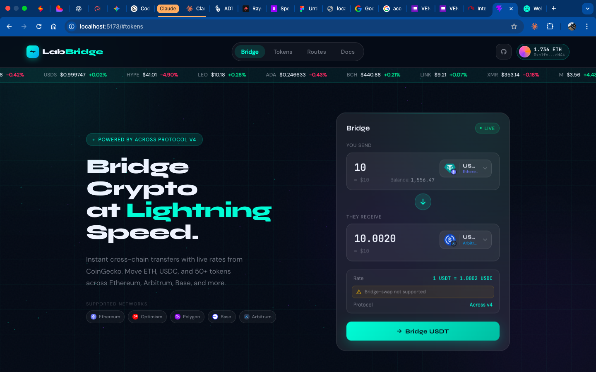

# LabBridge

> A glassmorphism cross-chain bridge UI powered by **Across Protocol** and **CoinGecko**.
> Bridge ETH, USDC, USDT, DAI, and WBTC across Ethereum, Arbitrum, Base, Optimism, and Polygon — with live prices, real relayer fees, and real fill-time estimates.



**[Live Demo →](https://labbridge-app.vercel.app)**

---

## Why I built it

After five full-stack capstones built around REST + PostgreSQL, I wanted to push into web3 UI territory: chain-aware components, live market data, real protocol integration, and the "financial terminal" visual language (mono numerics, glass cards, animated rate bars). LabBridge is the result.

It's a **UI demo**, not a live money-mover — no wallet signing, no on-chain transactions. But every rate, fee, and fill-time you see comes from a real API call to Across Protocol's mainnet endpoint.

## Features

- **Live token prices** pulled from CoinGecko (top 50 by market cap)
- **Real Across Protocol v3 quotes** — fetches `/suggested-fees` against real mainnet addresses, converts amounts with correct token decimals (6 for USDC, 8 for WBTC, 18 for ETH/DAI)
- **Chain-aware token selector** — filter the token list by chain, see chain badges overlaid on every token logo
- **Simulated wallet connect** — 6 mock wallets (MetaMask, Coinbase, WalletConnect, Trust, Phantom, Brave) with deterministic conic-gradient identicons
- **Smart CTA button** — swaps between *Connect Wallet / Select Tokens / Enter Amount / Insufficient [TOKEN] / Bridge [TOKEN]* based on state
- **Modern responsive navbar** with a morphing-line hamburger and centered pill nav on desktop
- **Glassmorphism** throughout — `backdrop-filter: blur`, cyan/violet accents, animated particles + orb drift

## Tech Stack

| Layer | Tool |
|---|---|
| **Frontend** | React 19 + TypeScript + Vite 8 |
| **Styling** | Tailwind CSS v4 (CSS-first config), custom glass tokens, JetBrains Mono for numerics |
| **Animation** | Framer Motion (spring physics, AnimatePresence) |
| **Backend** | Node + Express 5 + TypeScript (tsx watch) |
| **Data** | CoinGecko v3 API, Across Protocol `/suggested-fees` |
| **Deployment** | Vercel (frontend) + Render (backend) |

## Architecture

```
┌────────────────────┐        ┌─────────────────────┐
│  React + Vite      │  HTTP  │  Express server     │
│  (Vercel)          ├───────>│  (Render)           │
│                    │        │                     │
│  - Bridge UI       │        │  /api/tokens        ├──> CoinGecko API
│  - Token modal     │        │  /api/across-fee    ├──> Across Protocol
│  - Wallet sidebar  │        │  /health            │
└────────────────────┘        └─────────────────────┘
```

The server sits between the browser and third-party APIs so the CoinGecko key never leaks to the client, and the Across address + decimals registry lives server-side where it belongs.

## Getting Started

### Prerequisites

- Node.js ≥ 20.19
- A free [CoinGecko API key](https://www.coingecko.com/en/api/pricing)

### Install

```bash
git clone https://github.com/DennisMilli/labbridge.git
cd labbridge
npm install
```

### Configure

```bash
cp .env.example .env
# Edit .env and paste your CoinGecko key
```

### Run

In two terminals:

```bash
# Terminal 1 — backend
npm run server      # http://localhost:3001

# Terminal 2 — frontend
npm run dev         # http://localhost:5173
```

## Project Structure

```
src/
├── App.tsx                     # Root, state for wallet + modal open
├── components/
│   ├── Background.tsx          # Canvas particles + orb drift
│   ├── Header.tsx              # Sticky glass nav + identicon pill
│   ├── Bridge.tsx              # Converter card + hero + CTA state machine
│   ├── TokenModal.tsx          # Chain-filter + token list
│   ├── WalletSidebar.tsx       # 6 mock wallets, connect flow
│   ├── Ticker.tsx              # Marquee price ticker
│   └── Footer.tsx              # Social links + Across chip + disclaimer
├── icons/
│   ├── ChainIcons.tsx          # ETH / ARB / Polygon / Base / OP SVG marks
│   ├── WalletIcons.tsx         # MetaMask / Coinbase / etc. brand SVGs
│   ├── TokenWithChain.tsx      # Token logo + chain-badge overlay
│   └── Identicon.tsx           # Deterministic conic-gradient avatar
└── index.css                   # CSS-first Tailwind tokens (cyan / violet / glass)

server/
└── index.ts                    # Express: /api/tokens, /api/across-fee
```

## Key decisions

- **Express over pure serverless** — the Across address registry is ~60 lines of constants that benefit from living in one warm process, and a long-running server feels right for a portfolio piece. Easy to port to Vercel functions later if needed.
- **No wallet SDK** — the scope was UI, not signing. RainbowKit / Wagmi / viem add a lot of surface area; mock wallets let the UI breathe without chain-state headaches.
- **Across over Li.Fi / Socket** — Across's intents architecture is the most elegant DeFi bridge design I've read. Same-asset only is a real limitation, which the UI honestly surfaces (amber info pill) instead of papering over.
- **Tailwind v4 CSS-first** — no `tailwind.config.js`. All design tokens live in `index.css` under `@theme`. Much closer to how design systems actually ship.

## Deploy

### Frontend (Vercel)

1. Push the repo to GitHub
2. Import in Vercel dashboard
3. Set env: `VITE_API_URL=https://your-backend.onrender.com`
4. Deploy — auto-builds on every push to `main`

### Backend (Render)

1. New → Web Service → connect the repo
2. **Build command:** `npm install`
3. **Start command:** `npm run start`
4. Env: `COINGECKO_KEY=...`
5. Deploy

Free-tier Render sleeps after 15 min idle; first request after idle takes ~30s to cold-start. Upgrade to $7/mo or switch to Railway to avoid.****

## Credits

- **[Across Protocol](https://across.to)** — intent-based bridge infrastructure, secured by UMA
- **[CoinGecko](https://www.coingecko.com/en/api)** — market data
- **[Capstone #6 — LabCoatCoder](https://github.com/DennisMilli/capstoneProject6)** — inspiration for the morphing hamburger

## License

MIT — do what you want, don't sue me.

---

*Built as Capstone Project #8 in my self-taught full-stack journey.*
